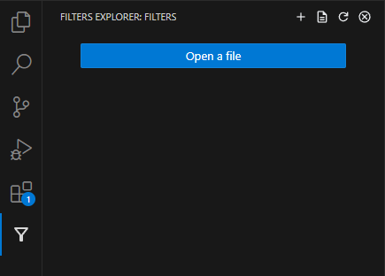
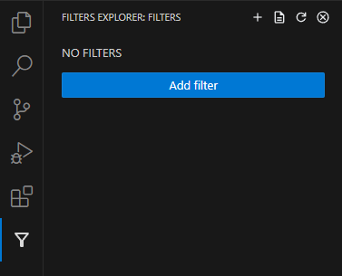
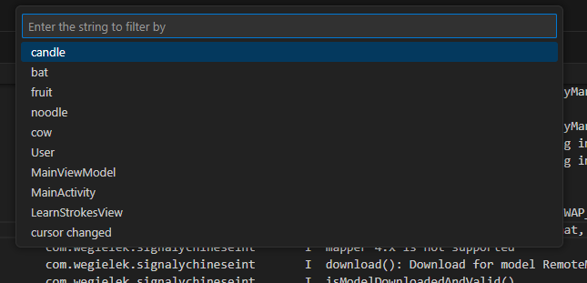
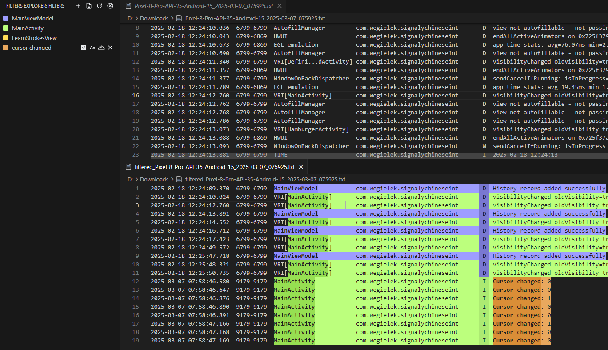
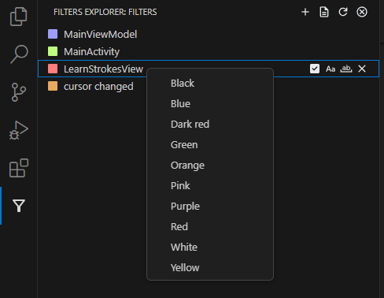
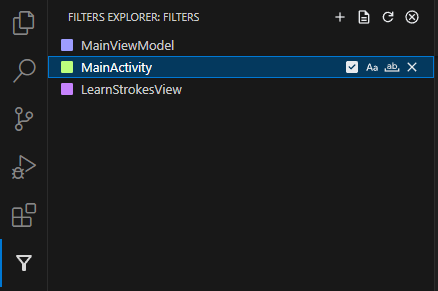

# Logs highlighter

Tool for analysis, filtering and custom highlighting of android logcat text logs.

### How to use the tool?

Open filters explorer from the sidebar on the left.

Click open file button or new file icon in the navigation bar to load the log text file.

With file loaded add the filter by clicking add filter button or plus icon in the navigation bar.

And enter new filter or choose one from the previous entries.

Filtered and highlighted logs will apear in the bottom editor.

Refresh button in the navigation bar refreshes the filters.

Change color of the highlight by right-click on the filter and choosing the color from the list.

Toggling checkbox hides/shows the filter highlights.

You can also toggle match case and match word.

You can remove filter by clicking X button.

Enjoy !!!